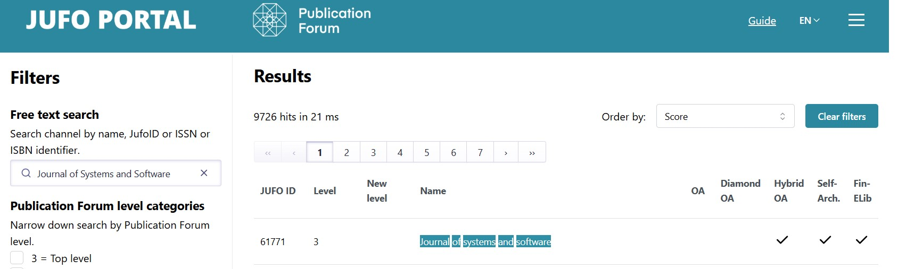

# h1 - Cyber Science

For this homework, I went on a little **Science Hunt** to track down a paper on cybersecurity in software development. 
I chose the keyword **Secure Software Development Lifecycle (SSDLC)** since it’s all about baking security into DevOps rather than bolting it on at the end.

Here is the article I picked: 
_**Zhao et al. (2024). Identifying the primary dimensions of DevSecOps: A multi-vocal literature review. Journal of Systems and Software, 214, 112063. https://doi.org/10.1016/j.jss.2024.112063**_ 
* _**Journal of Systems and Software is a **JUFO 3** journal.**_

In brief:
* This review article dives into DevSecOps, basically the **_"add security and stir"_** recipe for DevOps.
* It applies a Multi-vocal Literature Review (MLR), meaning it listens to both the academic white papers crowd and the real-world grey blog posts crowd.
* The big output is a Challenge-Practice-Tool-Metric (CPTM) model, a kind of roadmap that shows where DevSecOps is strong, where it stumbles, and how it’s being patched.

## What are the key areas being researched?

The review identifies five main branches of the DevSecOps codebase:

* Definitions: Endless naming debates (DevSecOps, SecDevOps, DevOpsSec or whatever).
* Challenges: Cultural silos, process bottlenecks, tricky tech, and good old **_business politics_**.
* Practices: Shift-left security, more collaboration, and plenty of automation scripts.
* Tools & Tech: CI/CD security plug-ins, container hardening, cloud lock-down kits.
* Metrics: Still trying to figure out _**how secure is secure enough?**_
* Global Software Engineering (GSE): Spoiler alert that distributed DevSecOps is still a mystery zone.

## What's widely agreed upon?

Across the literature, the following points are pretty clear:
* DevSecOps is not optional; _**Security is essential**_ and must be baked in, not just sprinkled on top.
* _**Collaboration and communications**_ between Developers, Operations, and Security teams are critical.
* _**The shift-left approach**_ is fundamental; Which means that security must be integrated early in SDLC. In other words, catch security bugs before they go live.
* _**Continuous training and security champions**_ help address skill gaps.
* _**Automation and tooling**_ are enablers, though not yet fully mature.

## What are the open questions?

Despite progress, there are still some unsolved tickets in the backlog:
* How do you balance pipeline speed vs. security without triggering a merge conflict?
* Which metrics actually prove your pipeline is secure?
* How do you sell business value of DevSecOps to leadership who only see $ signs?
* What happens when teams are global and distributed?
* Tooling is still fragmented and immature, like using five different APIs for one endpoint.
* Hot topics like AI in pipelines and platform engineering are just getting their first steps.

This review stitches together the academic theory and the hands-on hacks from industry into a CPTM model that maps challenges, practices, tools, and metrics.
DevSecOps is no longer a **nice-to-have**, but the repo still has lots of open issues: global adoption, measurement standards, and organizational buy-in.

In short: DevSecOps is growing up fast, but still in an early release cycle; Plenty of exciting features (and bugs of course) left for future research to fix.

