# h4 Feed me

Follow the scene. We've looked at science earlier, now we turn to blogsphere. In this task, we'll combine cybersecurity awareness, RSS feed usage, and safe port scanning.

## Why use a Feed Reader (RSS/Atom)?
* A feed reader automatically aggregates updates from multiple sources (e.g., security blogs, advisories).
* It saves time and you don’t need to manually visit each website.
* You get real-time alerts in one place, ideal for tracking vulnerabilities and new threats.
* Works even when websites change layout, feed stays consistent.
* Reduces distractions (no ads, pop-ups, or recommendation algorithms).
* You can read offline or archive posts for later.
* For example: Instead of checking Krebs, Schneier, and CVE sites separately, a reader shows all new posts together. It is like a cybersecurity _news console_.

## Supreme Court of Finland: Osuuspankkikeskus Port Scan (KKO:2003:36)
* A person used a port scanner to probe a bank’s computer network without authorization.
* The court decided that even scanning (without hacking further) can be considered unauthorized use or attempted intrusion, as it tries to access protected systems.
* The verdict: Port scanning is not harmless curiosity and it might be illegal if it is done without permission.
* Key lesson: Always scan only your own systems or those you have explicit authorization for.

## Install and Test Feed Reader
I installed **Thunderbird** as a feed reader. 

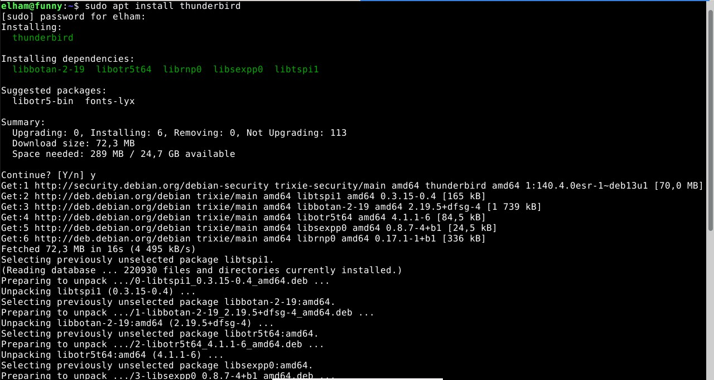

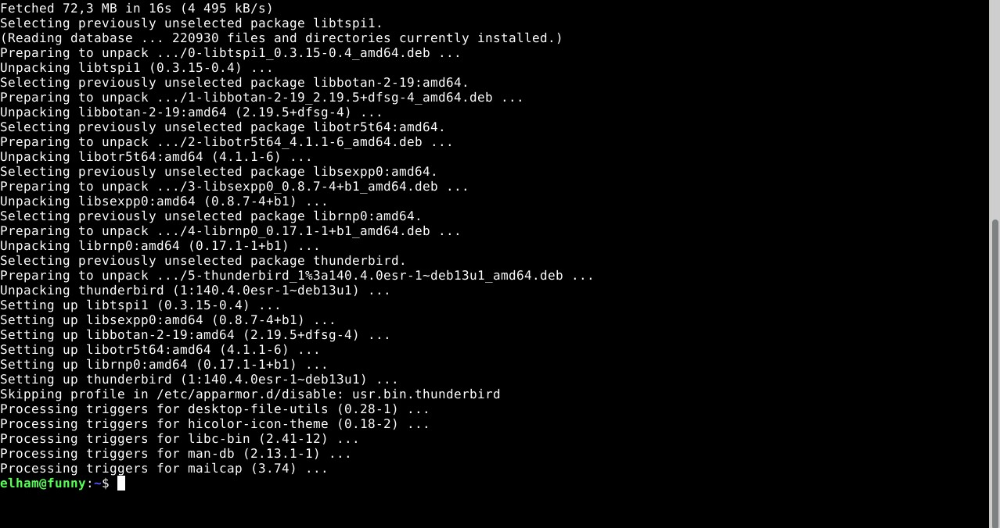

Then added a Feed Account called 'Security Feeds' and tested it first by adding 'https://terokarvinen.com/index.xml'. However it could not add it like shown in below screenshot.

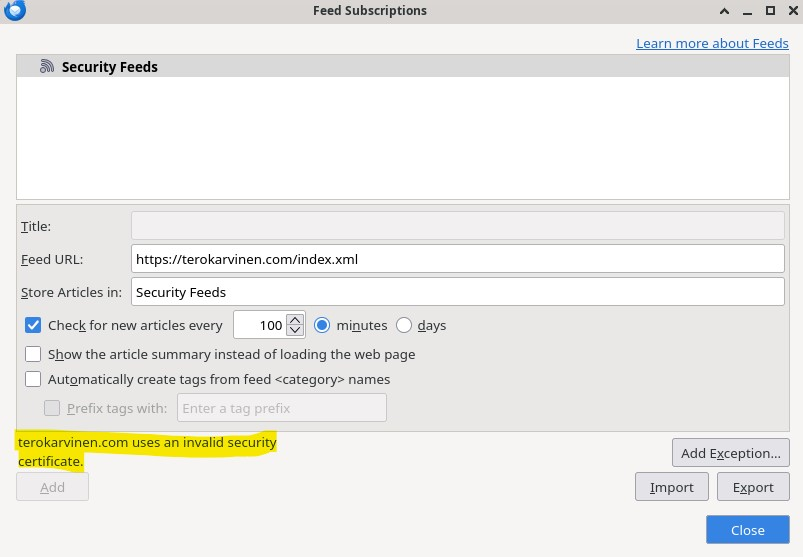

Then I tried to add the feed 'https://thehackernews.com/feeds/posts/default'. 

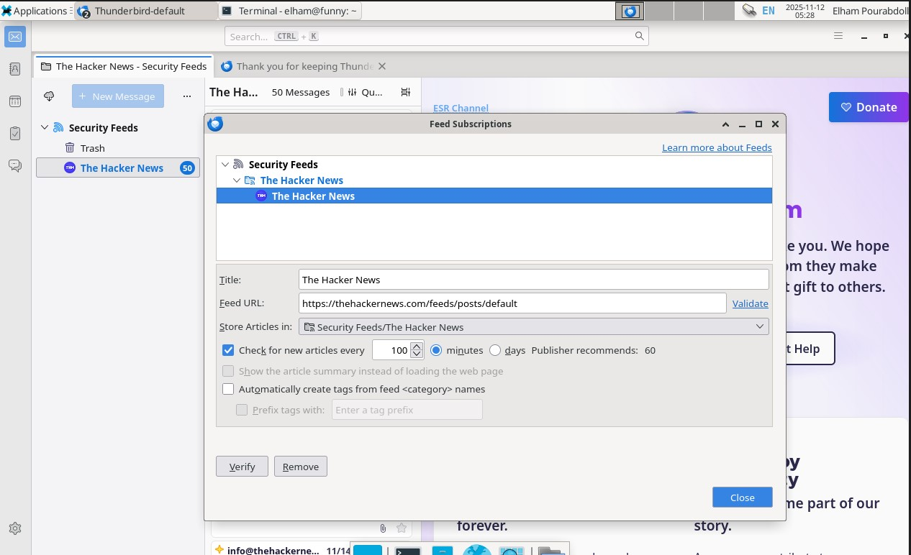

**Thunderbird** successfully displayed the latest blog posts under 'Security Feeds' folder, confirming that it can read RSS/Atom feeds. See screenshot showing the feed items.

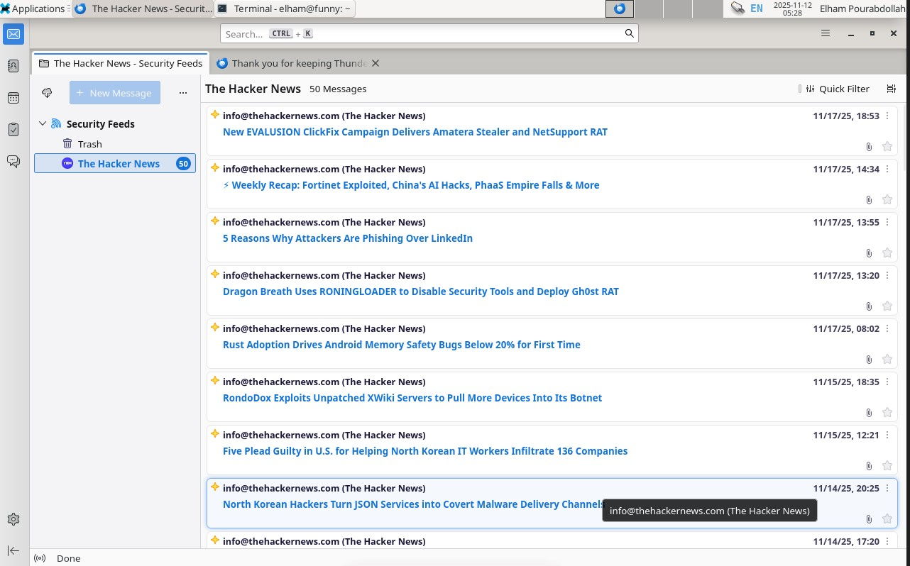

I also setup the _**River of news**_ (a single view that shows posts from all your subscriptions, latest first) in **Thunderbird** according to the instruction. 

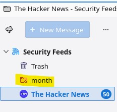

## Add Krebs Feed
Then I added feed for [Krebs](https://krebsonsecurity.com/feed/).

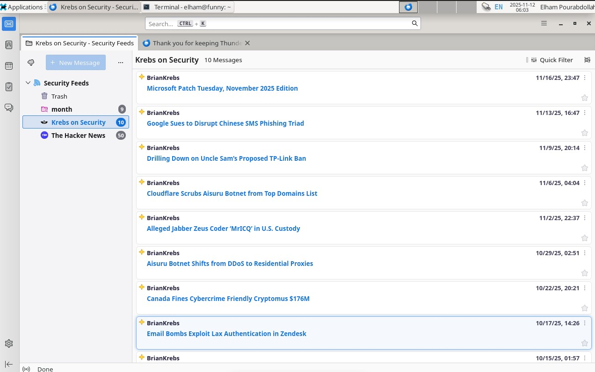

## Add Schneier on Security Feed
Then, added a feed for [Schneier on Security](https://www.schneier.com/feed/atom/) and found a blog, and located the feed.

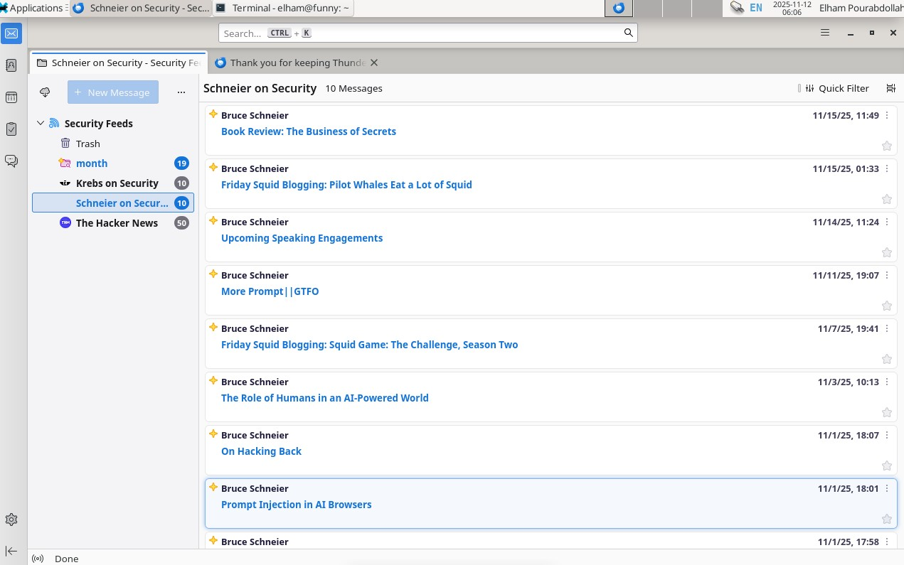

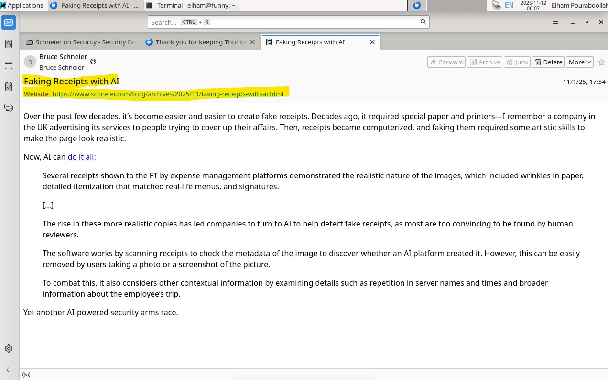

## Two Additional Security Feeds
I found two other security feeds by searching _top cybersecurity RSS feeds 2025_ and checking that sites support RSS/Atom.

1. [The Hacker News](https://thehackernews.com/feeds/posts/default)
   * Chosen for timely global cybersecurity alerts and breach reports.
   * I already added this while testing **Thunderbird**.

2. [BleepingComputer Security](https://www.bleepingcomputer.com/feed/)
   * Covers technical writeups and incident responses.
  
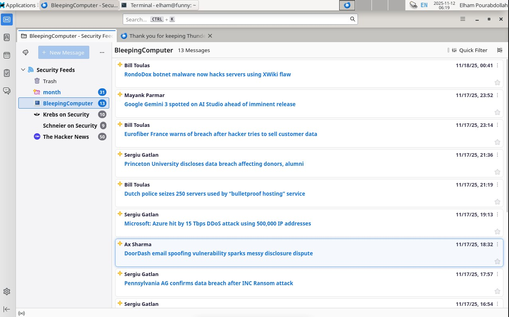

## Reflection on Following the Feeds

Here are what I learnt by following the feeds:

* Latest posts about phishing campaigns, zero-day exploits, and AI-driven attacks.
* Practical defenses and responses shared by experts like Krebs and Schneier.

Following the feeds with a reader would have some benefits and downsides.
* Benefits:
  - Centralized, distraction-free updates.
  - Fast overview of trends, especially useful for cybersecurity professionals.
* Downsides:
  - Need manual maintenance (old feeds may break).
  - Some sites limit content in feeds or delay updates.
  - Not interactive. You can’t easily comment or discuss within the reader.

## Port Scan (localhost only, offline)
1. Installed nmap port scanner using follwoing commands:
   * `sudo apt-get update`
   * `sudo apt-get install nmap`
2. Disconnected VM from the Internet. I disconnected the VM from internet by modifying the settings of the VM, my **VM** -> **Settings** -> **Network** -> **Adapter 1** -> uncheck **Enable Network Adapter**. Verified with:

   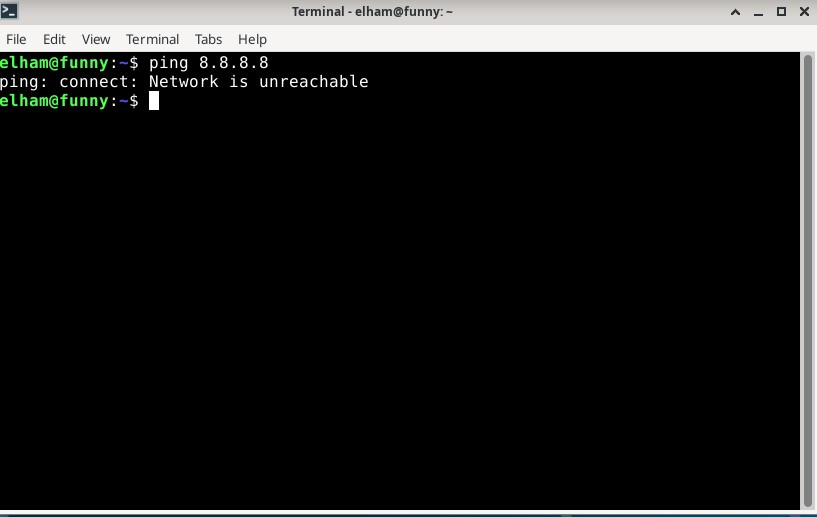
   
3. Scanned local machine using followng command:
   * `sudo nmap -A -v localhost`
   * Port _631/cups_ is running.
  
   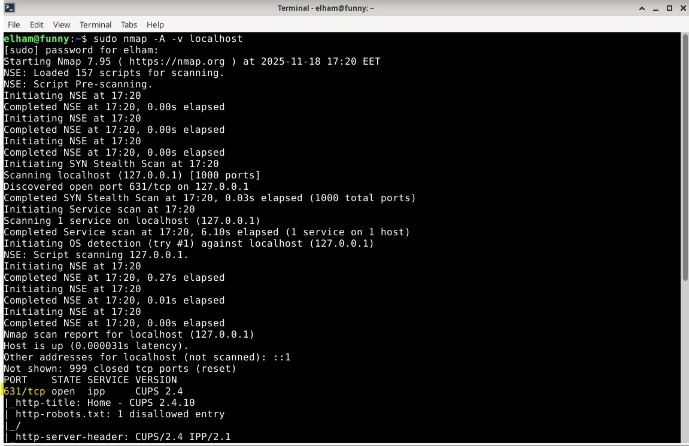
    
4. Connected to network and installed Apache2 using following commands:
   * `sudo apt-get install apache2`
   * `sudo systemctl start apache2`
5. Disconnected the VM from Internet and verifyied `ping 8.8.8.8` fails and then scanned again using following command:
   * `sudo nmap -A -v localhost`
   * Now port 80/tcp (HTTP) visible which confirms service added.

  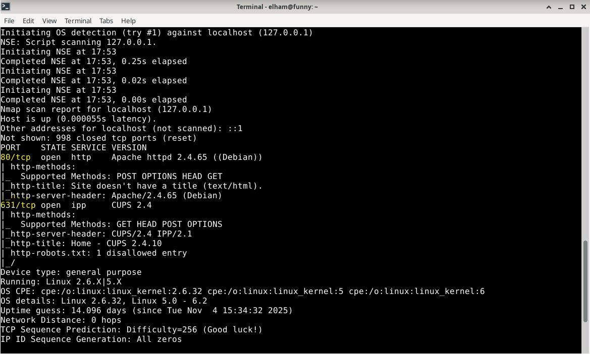
  
### Analysis:
* Nmap lists open ports (services "listening" for connections).
* Criminals could use similar scans remotely to identify what software a company runs (e.g., web server, database, mail system).
* Shows why firewalls, access control, and patching are critical.
* Ethical scanning: only allowed for your own systems or with permission.

## Voluntary Bonus
### Identify a Port Scan in Apache Logs
Even when scanning localhost, Apache still logs nmap’s probing attempts.
Apache logs are here in `/var/log/apache2/access.log` and `/var/log/apache2/error.log`.
While disconnected from Internet I ran `sudo nmap -A -v localhost` and then after the scan, inspected the access log using following command:
* `sudo grep -i "GET" /var/log/apache2/access.log`
* In `/var/log/apache2/access.log`, I found several entries generated by the nmap scan.

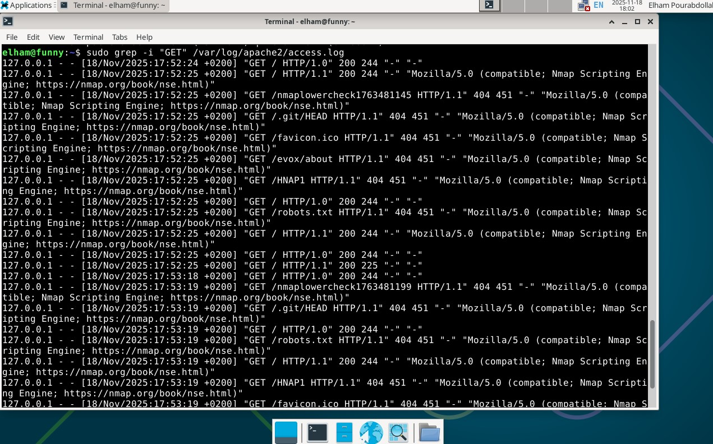
  
* They included `HEAD / HTTP/1.0` and `GET /` requests with the **Nmap Scripting Engine** user agent.
* This confirms that Apache can detect and log port scans even when performed locally.

### Modify Nmap Scan So It Cannot Be Detected
Here, the goal is to run a stealthier Nmap scan that does NOT show up in Apache logs.
* To avoid detection, I ran a **stealth scan** using `nmap -sS localhost`.
* Since a **SYN** scan does not send `HTTP GET/HEAD` requests, Apache did not record anything in `access.log`.
* Unlike the earlier `-A` scan, this scan did not trigger any **Nmap Scripting Engine** entries or any HTTP traffic.
* Therefore, using `-sS` (or NULL/FIN/Xmas scans) allows Nmap to identify open ports without being detected by Apache’s logs.

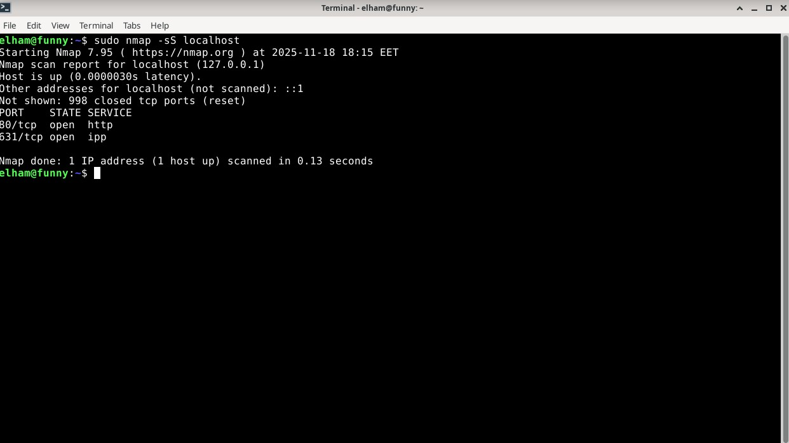
