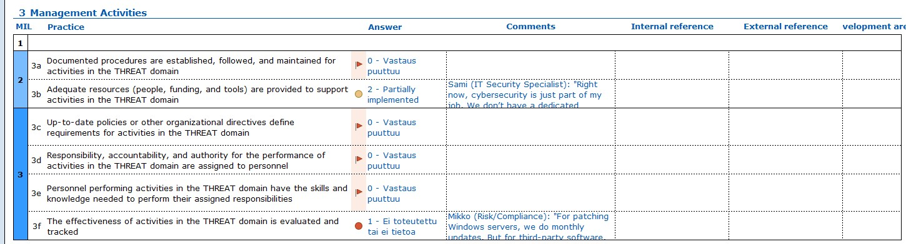

# h6 Mature

_Don't build a giant fence and leave the door open. Spreadsheets don't think. You think - hopefully together with stakeholders from other areas of your company._

## Summary of [Traficom: Cybermeter - User guide](https://terokarvinen.com/kybermittari/files/Kybermittari_Cybermeter_User_Guide_V1.pdf)

* Kybermittari (Cybermeter) is a cybersecurity-maturity assessment tool provided by NCSC-FI/Traficom.
* It allows organisations to self-assess their cyber-security capabilities across multiple domains: identification, protection, detection, response, recovery; plus supply-chain / external dependencies.
* The goal is to visualise maturity, identify strengths and weaknesses, and benchmark against sector averages (if data shared anonymously).

### Summary and checklist of the assessment process (p 10)

* The guide provides a structured assessment process for organisations to evaluate their cyber maturity.
* The process begins with preparation: collecting necessary information about systems, services, stakeholders.
* Then comes self-evaluation: answering questionnaire items across different domains and objectives.
* Results are compiled into a maturity report, highlighting current maturity levels, gaps, and recommended improvements.
* Organisations can optionally benchmark results against sector averages (if submitted) for context.
* Checklist includes assigning responsible persons, verifying data accuracy, documenting assets or services, and planning follow-up actions.

### 3 Cybermeter maturity model (p 11-14)

* The model defines maturity levels or maturity stages across domains of cybersecurity capability.
* Domains include (among others):
  - Protecting critical services
  - Asset, change & configuration management
  - Threat & vulnerability management
  - Identity & access management
  - Event or Incident management & continuity
  - Supply chain and external dependency management
* For each domain, there are descriptive criteria for different maturity levels, from minimal practices to fully mature, well-documented processes.
* Maturity is not only technical, it also covers governance, management, human resources, and organisational practices.
* The model is inspired by international frameworks: notably the NIST Cybersecurity Framework (CSF) and the Cybersecurity Capability Maturity Model (C2M2).

### The Cybermeter maturity report (p 23)

* After completing the questionnaire, the tool generates a Maturity Report summarizing:
  - Current maturity levels per domain
  - Strengths and weaknesses in each area
  - Recommended measures for improvement (based on identified gaps) 
* The report helps organisations prioritise cybersecurity investments and prepare a roadmap for improvements.
* The report can also be used to document compliance status, risk posture, and as a baseline for future assessments

## Overview of Traficom: Kybermittari spreadsheet (The actual tool) [Traficom: Kybermittari spreadsheet](https://terokarvinen.com/kybermittari/files/Kybermittarin%20arviointity%C3%B6kalu_v2.1_20230829.xlsx)

* The spreadsheet implements the questionnaire or assessment which organisations fill in their status for each criterion across domains.
* It is freely available to companies, associations, public organisations, regardless of size or sector.
* Its design is sector-agnostic and technology-agnostic: suitable for critical infrastructure, small companies, or public institutions.
* The spreadsheet helps produce a quantifiable output (scores, maturity levels) that can be tracked over time, enabling follow-up assessments and measuring progress.

## Make-belief analysis
Here is a short story of choosing a couple of subpoints in Kybermittari with imaginary persons with roles, who talk to each other, to decide and comment on maturity. 

_Chosen Kybermittari Domain_ is **3. Threat & Vulnerability Management**.

_Chosen Subpoints_ are **3b, Adequate resources (people, funding, and tools) are provided to support activities in the THREAT domain** and **3f, Patch management process**.

My _Make-Belief Team_ with imaginary characters are: **Sami (IT Security Specialist), Laura (CFO (finance, non-technical)), Oskari (Head of Operations), Merja (External Cybersecurity Consultant)**

### Short Story for Subpoint 3b, Adequate resources (people, funding, and tools) are provided to support activities in the THREAT domain
Let's consider following conversation in my imaginary team meeting about adequate resources (people, funding, and tools) which are provided to support activities in the THREAT domain (For this part I used chat-gpt for imaginary dialouge creation): 

```
Sami (IT Security Specialist): "Right now, cybersecurity is just part of my job. We don’t have a dedicated security team, and I handle threat monitoring in between other tasks."

Laura (CFO): "There’s no separate budget line for cybersecurity. If we need a tool, we request it during the year — there’s no planned funding."

Oskari (Operations): "We don’t have clear roles or backup personnel. If Sami is on holiday, nobody monitors threats."

Merja (Consultant): "Kybermittari says ‘adequate resources’ means dedicated roles, budget, and tooling. You do have some tools, but neither defined roles nor predictable funding. That matches MIL 2, Basic."
```

**Decision for 3b, Adequate resources (people, funding, and tools) are provided to support activities in the THREAT domain:**
* **MIL**: 2, Basic
* **Reason**: Some tools exist and one person handles security tasks, but there is no dedicated budget, no formal responsibilities, and no staffing redundancy.

### Short Story for Subpoint 3f, The effectiveness of activities in the THREAT domain is evaluated and tracked
Let's consider following conversation in my imaginary team meeting about the effectiveness of activities in the THREAT domain (For this part I used chat-gpt for imaginary dialouge creation):

```
Sami: "We react to phishing emails and suspicious logins, but we don’t measure anything. We don’t track how long it takes to respond or whether cases are increasing or decreasing."

Oskari: "We had a ransomware scare last spring, but after we solved it, nobody documented lessons learned or post-incident metrics."

Laura: "So we don’t produce monthly or quarterly security reports?"

Merja: "Correct. To reach MIL 2 or 3, you would need: KPIs, dashboards or logs reviewed regularly, evidence of improvement over time. Right now, it is ad hoc and not tracked.”
```

**Decision for 3f, The effectiveness of activities in the THREAT domain is evaluated and tracked:** 
* **MIL**: 1, Initial
* **Reason:** Threat response happens informally, but no metrics, no tracking, no reporting, and no evidence of improvement.




## Sucks or succeeds

Here I will try to answer how could Kybermittari process be really useless and how could it be really useful?

### When Kybermittari could be useless

* Used as a checkbox exercise
  - Someone just clicks answers without actual analysis or evidence.
* No follow-up actions
  - Results are collected but nobody implements improvements.
* Incorrect people answering
  - Only IT answers, without input from management, HR, or operations.
* Lack of context
  - Organization doesn’t customize questions to their environment (e.g., cloud, OT, SaaS).
* Data is outdated
  - Assessment done once, then ignored for a year or more.
* Political answers
  - People answer "how things should be" instead of "how things are".
* No management support
  - Results don’t lead to budget, training, or policy changes.

In summary, Kybermittari is useless when it becomes a theoretical self-assessment with no consequences or accuracy.

### When Kybermittari could be very useful

* First maturity baseline
  - Helps identify "where we are now" in cybersecurity capability.
* Roadmap creation
  - Based on low-scoring areas, organization can prioritise specific improvements.
* Communication tool
  - Translates technical issues into business language and management visuals.
* Benchmarking
  - Organisation can compare against similar organisations or sector averages.
* Cross-department alignment
  - Forces different units to discuss cybersecurity responsibilities and processes.
* Continuous improvement
  - Repeat the assessment every 6–12 months to measure progress.
* Investment justification
  - "Our maturity in incident management is 1/5, therefore, we need training or tooling."
 
In summary, Kybermittari succeeds when used as a structured improvement process, not just a form.

## Competition: What alternative models or tools compete with Kybermittari?

Here are couple of examples of other frameworks or tools which could compete with Kybermittari with their bnefits and downsides.

### Example 1: NIST Cybersecurity Framework (NIST CSF)

 **NIST CSF** is a widely used security framework by the U.S. National Institute of Standards and Technology. It defines 5 core functions: Identify, Protect, Detect, Respond, Recover.
 
 **NIST CSF** has very similar maturity domains to Kybermittari and provides controls, subcategories, and scalable guidelines.
 
 It has some benefits over Kybermittari which are: it is internationally recognized, significant documentation is available, and it has more detailed control references. However, it has also some ownsides, to mention some of them:
 It is more complex to implement, it is less "plug-and-play" (no ready Excel tool by default), and it requires interpretation and expertise.

### Example 2: CIS Controls (Center for Internet Security)

**CIS Controls** is a list of actionable security controls such as: inventory, logging, patching, access control.

**CIS Controls** is very practical and technical compared to Kybermittari.

It has some benefits over Kybermittari which are: Its simple and actionable controls, it is good for technical teams, and it has many ready checklists and benchmarks. However, it has also some ownsides, like: 
It doesn’t provide maturity scoring by default, and it has less management/process focus

### Summary
Kybermittari competes mainly with international frameworks such as NIST CSF, and CIS Controls. 
These offer broader or more formalized approaches, but they are typically more complex or expensive, while Kybermittari remains a free, fast, and Finnish-context tool for self-assessment.

## References
* https://terokarvinen.com/cyber-security/
* https://terokarvinen.com/kybermittari/files/Kybermittari_Cybermeter_User_Guide_V1.pdf
* https://terokarvinen.com/kybermittari/files/Kybermittarin%20arviointity%C3%B6kalu_v2.1_20230829.xlsx
* https://terokarvinen.com/kybermittari/
* https://www.kyberturvallisuuskeskus.fi/en/our-services/situation-awareness-and-network-management
* https://www.fraktal.fi/case/developing-cyber-security-maturity-with-kybermittari/
* https://www.nist.gov/cyberframework
* https://nvlpubs.nist.gov/nistpubs/CSWP/NIST.CSWP.04162018.pdf
* https://www.cisecurity.org/controls/cis-controls-list

